# Architecture

```mermaid
%%{init: {"flowchart": {"useMaxWidth": false, "nodeSpacing": 70, "rankSpacing": 90, "diagramPadding": 24, "subGraphTitleMargin": {"top": 8, "bottom": 20}}}}%%
flowchart LR
    subgraph PolicyKernel[Agentic policy kernel]
        Agents["AGENTS.md<br/><br/>manager role and policy entry point"]
        ProjectManagement["DATA_ROOT/PROJECT_MANAGEMENT.md<br/><br/>project structure and sequencing"]
        Workflow["DATA_ROOT/WORKFLOW.md<br/><br/>task, job, dependency, and review policy"]
        Coding["DATA_ROOT/CODING.md<br/><br/>coding and codebase policy"]

        Agents --> ProjectManagement
        Agents --> Workflow
        Agents --> Coding
    end

    subgraph Arrival[How the data arrives]
        User([User])
        Manager["Manager agent<br/>ongoing Pi conversation"]
        Translation["Translate conversation into a task<br/><br/>projectId<br/>workspaceId<br/>intent?<br/>outcomes?<br/>background"]
        PlanJobs["Define each job<br/><br/>jobType<br/>instructions"]
        AssignIds["Generate stable IDs<br/><br/>taskId<br/>jobId<br/>workerSessionId"]
        Create["Create database rows,<br/>task files, and isolated worktrees"]
        Runner["Detached worker<br/>executes the request"]
        Observe["Manager observes completion<br/>and retrieves the result"]

        User -->|prompts, corrections, follow-ups| Manager
        Manager -->|responses and questions| User
        Manager --> Translation
        Translation --> PlanJobs
        PlanJobs --> AssignIds
        AssignIds --> Create
        Runner --> Observe
        Observe --> Manager
    end

    subgraph Data[Important stored data]
        direction LR

        subgraph Tables[Tables]
            direction LR

            Project["projects<br/><br/>id<br/>directoryName<br/>title<br/>description?<br/>createdAt<br/>lastUsedAt"]

            Workspace["workspaces<br/><br/>id<br/>name<br/>rootDir<br/>authorization metadata"]

            ProjectTask["projects_tasks<br/><br/>projectId<br/>taskId<br/>addedAt"]

            Task["tasks<br/><br/>id<br/>workspaceId?<br/>title<br/>status<br/>createdAt<br/>finishedAt"]

            Job["jobs<br/><br/>id<br/>taskId<br/>jobType<br/>parentSessionId<br/>parentSessionFile<br/>harness<br/>model<br/>effortLevel<br/>modelName<br/>modelVersion<br/>title<br/>status<br/>progress<br/>createdAt<br/>finishedAt<br/>bundlePath<br/>userNotified<br/>agentNotified"]

            WorkerSession["workerSessions<br/><br/>id<br/>jobId<br/>harnessSessionId?<br/>harnessSessionPath?<br/>storagePath<br/>createdAt"]

            Dependency["jobDependencies<br/><br/>jobId<br/>dependsOnJobId<br/>relationship"]
        end

        subgraph Files[" "]
            direction LR

            FilesTitle["Important files and directories"]:::groupTitle

            DataRoot["DATA_ROOT<br/><br/>default: work/<br/>override: DATA_ROOT, PI_WORKER_AGENT_DATA_ROOT"]

            ProjectFiles["projects/project/<br/><br/>governed by PROJECT_MANAGEMENT.md"]

            Worktree["worktrees/job_id/<br/><br/>isolated git checkout"]

            subgraph TaskFiles[" "]
                direction TB

                TaskFilesTitle["tasks/uuid_prefix/task_uuid/"]:::groupTitle

                Intent["intent.md (optional)<br/><br/>user's intent, ideally in their own words"]

                Outcomes["outcomes.md (optional)<br/><br/>checklist of expected results"]

                Background["background.md<br/><br/>relevant facts, decisions, constraints,<br/>and conversation summary"]

                subgraph JobFiles["jobs/job_id/"]
                    direction TB

                    Request["request.md<br/><br/>exact job instructions"]

                    subgraph SessionFiles["worker-sessions/session_id/"]
                        Events["events.jsonl<br/><br/>timestamp<br/>type<br/>text?<br/>toolCallId?<br/>toolName?<br/>arguments?<br/>result?<br/>isError?<br/>pid?<br/>exitCode?<br/>error?<br/>artifactPath?"]
                    end

                    Request ~~~ Events
                end

                TaskFilesTitle ~~~ Intent
            end

            FilesTitle ~~~ DataRoot
            DataRoot --> ProjectFiles
            DataRoot --> Worktree
            DataRoot --> TaskFilesTitle
        end
    end

    Agents --> Manager
    ProjectManagement -->|governs project path| ProjectFiles
    ProjectManagement -->|guides delivery| Manager
    Workflow -->|guides task and job decisions| Manager
    Coding -->|guides coding requests| Manager

    Project -->|identity and task grouping| Manager
    Workspace -->|authorized rootDir| Manager
    Workspace -->|rootDir for workspaceId| Create
    Create -->|insert and later update| Task
    Create -->|insert| ProjectTask
    Create -->|insert and later update| Job
    Create -->|insert| WorkerSession
    Workspace -.->|id referenced by tasks.workspaceId| Task
    Project -.->|projectId| ProjectTask
    Task -.->|taskId| ProjectTask
    Task -.->|id referenced by jobs.taskId| Job
    Job -.->|id referenced by workerSessions.jobId| WorkerSession
    Job -.->|id referenced by both job ID fields| Dependency
    Create -->|create from rootDir using job id| Worktree
    Worktree -->|working directory| Runner
    Runner -->|file changes| Worktree
    Create -->|write| Intent
    Create -->|write| Outcomes
    Create -->|write| Background
    Create -->|write| Request

    Job -->|job ID and execution details| Runner
    WorkerSession -->|harness session identity and storage path| Runner
    Runner -->|harness session ID and path| WorkerSession
    Request -->|instructions| Runner
    Intent -->|optional purpose and specifications| Runner
    Outcomes -->|optional expected results| Runner
    Background -->|context| Runner
    Runner -->|update job status and progress| Job
    Runner -->|append lifecycle, conversation, thinking, and tool events| Events

    Job -->|status and progress| Observe
    Events -->|derive conversation, turns, tool calls, and final result| Observe

    classDef groupTitle fill:transparent,stroke:transparent,font-weight:bold
```



## Agentic policy kernel

The core Markdown files act as an agentic policy kernel: they define how the manager interprets work and uses the system without hardcoding one organization's process into application code.

- `AGENTS.md` is the entry point for the manager role and policy set.
- `DATA_ROOT/PROJECT_MANAGEMENT.md` governs project structure, sequencing, and feedback cycles under `DATA_ROOT/projects/`.
- `DATA_ROOT/WORKFLOW.md` governs how tasks, jobs, dependencies, results, revisions, and approvals are managed.
- `DATA_ROOT/CODING.md` governs coding and codebase practices used when preparing and evaluating coding work.
- `examples/` contains policy templates that consumers can copy and customize. This maintainer checkout's `work/` directory symlinks to them only so the examples can be maintained and used in place; symlinking is not a system feature or the expected consumer setup.

Users can revise these policies while the task, job, persistence, and execution mechanisms remain general.

## Data root

`DATA_ROOT` is the configured root for worker-agent SQLite metadata, project-management files, canonical task files, and worktrees. It defaults to the project-local, gitignored directory:

```text
work/
```

Consumers can set `DATA_ROOT` in the environment or a Bun-loaded `.env` file to choose another location. `PI_WORKER_AGENT_DATA_ROOT` is also accepted and takes precedence when both are set:

```dotenv
DATA_ROOT=/path/to/worker-agent-data
# or, with precedence over DATA_ROOT:
PI_WORKER_AGENT_DATA_ROOT=/path/to/worker-agent-data
```

All paths in the storage layout below are relative to `DATA_ROOT`. Consumers normally copy the policy templates from `examples/` into their chosen data root and customize them, or create their own policies.

## Initial inputs

The user and manager agent discuss a piece of work. The manager translates the relevant parts of that conversation into:

- **`projectId`** — the registered management project associated with the task.
- **`workspaceId`** — the user-authorized execution location selected for the task.
- Optional **`intent`** — why the user wants the work and the shape they want it to take, ideally preserved in their own words.
- Optional **`outcomes`** — a checklist of what should be observable when the task is complete.
- **`background`** — relevant facts, decisions, constraints, or a conversation summary needed to understand the task.

The manager harvests `intent` from the conversation rather than requiring the user to write a formal specification. It should preserve the user's wording even when that wording is informal or woolly. Technical specifications in the user's intent should remain intact because they may determine the shape of the result. If the user does not want to formalize intent, the manager writes a minimal faithful statement without adding ceremony.

When captured, `outcomes` should be an explicit checklist rather than something inferred from a short title. The manager may derive the checklist from the conversation, and the user may review or clarify it before jobs start.

When present, `intent` and `outcomes` are the primary basis for reviewing whether the completed task achieved what the user wanted. Either or both may be omitted when they would add no value. `background` provides context but is not itself an acceptance checklist.

The manager decomposes the task into jobs. Each job has:

- **`jobType`** — the purpose of the job.
- **`instructions`** — what that specific worker should do and return.

## Identity and creation order

The application generates stable IDs before creating database rows or filesystem records. SQLite and the filesystem do not assign these IDs.

- Generate bare UUIDs for project, workspace, and task identities. Manager tools accept an exact ID or any unique shorthand of at least four leading characters.
- Generate `taskId` as a bare UUID, then use it for `tasks.id` and `tasks/<first-two-hex-digits>/<task-uuid>/`. The single two-character prefix level distributes tasks across 256 directories without adding unnecessary traversal depth.
- Generate each `jobId`, then use it for `jobs.id`, `jobs/<job-id>/`, and the derived `worktrees/<job-id>/` path.
- Generate each `workerSessionId`, then use it for `workerSessions.id` and `worker-sessions/<session-id>/`.

The manager selects a registered management project and an authorized workspace, loads the workspace's `rootDir`, generates `taskId`, and atomically creates both the task and its `projects_tasks` association. Demonstrations use this same project, workspace, task, job, worker-session, and worktree flow rather than a hardcoded command or generated-project fixture.

## Metadata (database)

SQLite stores structured metadata and query-friendly current-state projections.

### `projects`

Each immediate `$DATA_ROOT/projects/<directoryName>` subdirectory maps to durable project metadata.

- `id` — synthetic project identity.
- `directoryName` — unique directory mapping under `DATA_ROOT/projects/`.
- `title` and optional `description` — enough identifying context to understand the project if its file store is unavailable.
- `createdAt` and `lastUsedAt` — registration and activity timestamps.

### `workspaces`

Workspaces are user-authorized codebase locations, independent of management-project identity.

- `id` — workspace identity used by tasks.
- `name` — user-facing workspace name.
- `rootDir` — canonical codebase checkout path.
- `createdAt`, `lastUsedAt`, and authorization metadata — registration, activity, and approval audit data.

### `projects_tasks`

- `projectId` and `taskId` associate projects and tasks without relying on Markdown references.
- `addedAt` records when the association was created.
- The composite primary key prevents duplicate associations.

### `tasks`

- `id` — task identity.
- `workspaceId` — optional reference to `workspaces.id`.
- `title` — short, action-oriented summary derived by the manager from the available task files.
- `status` — overall task state.
- `createdAt` and `finishedAt` — task lifetime.
- One task can contain multiple jobs, such as implementation, review, and fixes.
- Example title: `Investigate flaky authentication tests`.

Task statuses:

- `queued` — created, but no job has started.
- `running` — at least one job has started and the task is not terminal.
- `completed` — all required jobs completed successfully.
- `failed` — a required job failed and the workflow cannot continue.
- `cancelled` — the task was explicitly cancelled.

Typical transitions are `queued → running → completed | failed | cancelled`. Starting a job moves the task to `running`, and a failed required job may move it to `failed`. The runner does not mark a task complete merely because every currently existing job has completed: the manager applies `WORKFLOW.md`, determines whether more jobs are required, evaluates the outcomes, and explicitly settles the task.

### `jobs`

- `id` — job identity.
- `taskId` — required reference to `tasks.id`.
- `jobType` — purpose such as `investigate`, `plan`, `implement`, `review`, `test`, or `fix`.
- `parentSessionId` and `parentSessionFile` — managing Pi session that owns notifications.
- `harness` — worker harness, such as Cursor, Codex, or Pi.
- `model` — exact model value used by the harness.
- `effortLevel` — requested reasoning or effort setting.
- `modelName` and `modelVersion` — normalized model identity for querying and comparison.
- `title` — short summary of this specific job.
- `status` and `progress` — current query-friendly projections.
- `createdAt` and `finishedAt` — overall job lifetime.
- `bundlePath` — job's file-storage directory.
- `userNotified` and `agentNotified` — completion-delivery state.
- Allowed `jobType` values are defined in TypeScript and stored as database text rather than as a database enum.

Job statuses:

- `blocked` — waiting for dependencies.
- `queued` — dependencies are satisfied and the job is waiting to start.
- `running` — the worker is executing.
- `completed` — the worker finished successfully; review findings do not by themselves make a review job fail.
- `failed` — the worker or harness failed.
- `cancelled` — explicitly cancelled before or during execution.
- `skipped` — not executed because a required dependency failed or was cancelled.

Typical transitions are `blocked → queued → running → completed | failed | cancelled`, with `blocked → skipped` for an unsatisfied failed dependency. Crashed workers are treated as `failed` in v0 rather than introducing a separate orphaned status.

### `workerSessions`

One job owns one resumable worker session.

- `id` — this system's worker-session ID.
- `jobId` — required reference to `jobs.id`.
- `harnessSessionId` — Cursor chat ID, Codex thread ID, or Pi session ID, when available.
- `harnessSessionPath` — harness-owned session file, when available.
- `storagePath` — this system's worker-session directory containing `events.jsonl`.
- `createdAt` — when the worker-session record was created.

### `jobDependencies`

- `jobId` — the dependent job.
- `dependsOnJobId` — an earlier job it needs.
- `relationship` — why it depends on that job, such as `reviews`, `modifies`, or `addresses`.

## Task data (file-based)

Task, job, and worker-session content is stored under the task directory. Worktrees are stored separately because they are temporary operational checkouts.

```text
DATA_ROOT/
├── PROJECT_MANAGEMENT.md    # project structure and sequencing policy
├── WORKFLOW.md              # task, job, dependency, and review policy
├── CODING.md                # coding policy
├── projects/
│   └── <project>/           # structure governed by PROJECT_MANAGEMENT.md
├── tasks/
│   └── <first-two-hex-digits>/
│       └── <task-uuid>/
│           ├── intent.md        # optional
│           ├── outcomes.md      # optional
│           ├── background.md
│           └── jobs/
│               └── <job-id>/
│                   ├── request.md
│                   └── worker-sessions/
│                       └── <session-id>/
│                           └── events.jsonl
└── worktrees/
    └── <job-id>/
```

### `tasks/<first-two-hex-digits>/<task-uuid>/`

Files owned by the task and shared by all of its jobs:

- Optional `intent.md` — the user's intent, ideally in their own words, including any technical specifications that should shape the result.
- Optional `outcomes.md` — a reviewable checklist of what should be observable at the end of the task.
- `background.md` — relevant facts, decisions, constraints, and conversation context.

When present, use `intent.md` and the checklist in `outcomes.md` to review the completed task.

### `tasks/<first-two-hex-digits>/<task-uuid>/jobs/<job-id>/`

Files owned by one job:

- `request.md` — exact instructions for the worker.

### `tasks/<first-two-hex-digits>/<task-uuid>/jobs/<job-id>/worker-sessions/<session-id>/`

Files owned by one worker session:

- `events.jsonl` — canonical append-only worker-session record.

#### Common event fields

Every event has:

- `timestamp` — when it was recorded.
- `type` — what happened.

#### Session and process events

Types:

- `session.started`
- `session.completed`
- `error`
- `cancelled`

Fields when relevant:

- `pid`
- `exitCode`
- `error`

#### Prompt and assistant events

Types:

- `prompt`
- `assistant.started`
- `assistant.text`
- `assistant.thinking`
- `assistant.completed`

Fields when relevant:

- `text`

Thinking is recorded only when the harness exposes it.

#### Tool events

Types:

- `tool.started`
- `tool.output`
- `tool.completed`

Fields when relevant:

- `toolCallId`
- `toolName`
- `arguments`
- `result`
- `isError`
- `artifactPath` — references output that is too large to store inline.

`toolCallId` is the only correlation ID in the event format. The harness normally provides it; an adapter assigns one when it does not.

#### Event-log rules

- `events.jsonl` is append-only and records everything observable as it happens.
- Its path identifies the worker session, job, and task, so those IDs are not repeated in each event.
- File order provides message and turn order; `turnId`, `messageId`, and sequence fields are unnecessary.
- Large outputs are stored separately and referenced with `artifactPath`.

#### Derived views

- The conversation transcript is derived by replaying message, thinking, and tool events.
- Turns are derived from ordered assistant and tool events; they do not need IDs or tables.
- Tool calls are grouped by `toolCallId`; they do not need a table.
- The final response is the last completed assistant message when the job settles successfully.
- A generated `final.md` may be provided as a disposable export, but `events.jsonl` remains authoritative.
- Database job status and progress are projections used by the manager and widget; the event log preserves their history.

### Worktree

For an implementation job, the extension:

- Creates the job and assigns its `id`.
- Loads the workspace through `tasks.workspaceId`.
- Reads the workspace's `rootDir`.
- Computes the worktree path as `worktrees/<job-id>/`.
- Creates the git worktree.
- Executes the worker inside it.

The worktree path is derived from the implementation job `id`; it is not stored on the job. A review follows its dependency chain to the implementation job and runs read-only inside that same worktree.

## Manager permissions

The Pi extension starts in restricted manager mode. Its application-enforced allowlist exposes read tools and worker-agent orchestration tools, while a `tool_call` guard blocks every other tool even if another extension reactivates it. The manager may inspect and propose any workspace path through `worker_register_workspace`, but the tool fails without interactive UI and records the canonical path in SQLite only after the user approves the displayed name, path, action, and Git status. Project registration accepts only existing immediate subdirectories under `$DATA_ROOT/projects/`, stores a synthetic ID plus identifying metadata, and never derives task membership by parsing Markdown. Task creation accepts a registered project ID and authorized workspace ID, creates the `projects_tasks` association transactionally, and delegation revalidates that the recorded canonical workspace path remains accessible. Managers answer project-status questions through the joined project-task query tool; `taskid://...` references remain documentation links.

Unrestricted coding is an explicit user elevation rather than an agent decision. `/development-mode` requires interactive confirmation and lasts only for the current session; `/manager-mode`, reload, and session replacement restore the restricted manager profile.

When a detached worker settles, the completion monitor injects its durable result and triggers a manager turn. The manager re-reads policy, evaluates the result, and chooses the next transition. The runner does not encode or create workflow successors. If the task outcome is accepted, the manager explicitly completes it through a narrow tool. Application code rejects completion while jobs remain active, but does not infer workflow meaning from job types, order, or settled results.

Workers have a separate process-level boundary. Before spawning Pi, the harness initializes `@anthropic-ai/sandbox-runtime` and wraps the entire worker process tree. macOS uses `sandbox-exec`; Linux uses Bubblewrap and required helper tools; Windows and unsupported or misconfigured platforms fail before Pi starts. The sandbox denies writes by default and allows only canonical worker-session paths, a private temporary directory, and the assigned implementation worktree for writable jobs. Sandbox setup and cleanup are part of the harness lifecycle rather than instructions trusted to the worker.

## Source layout

```text
src/
├── extension.ts       # minimal Pi extension entry point
├── extension/         # manager-facing task/job tools, commands, lifecycle, and notifications
├── workflows/         # task/job orchestration and dependency scheduling
├── domain/            # data types, IDs, statuses, and dependency rules; no I/O
├── infrastructure/    # nullable wrappers grouped by filesystem, git, Pi, process, SQLite, and system
├── storage/           # metadata and file-storage consumers, repositories, and paths
├── harnesses/         # pure normalization for Pi and later harnesses
└── runner/            # detached worker orchestration and process entry point
```

Code tests live in `__tests__/` directories collocated with the module under test; live integration tests live under `tests/integration/`. Keep pure formatting and conversion logic as functions; use classes for stateful services and lifecycle ownership.
