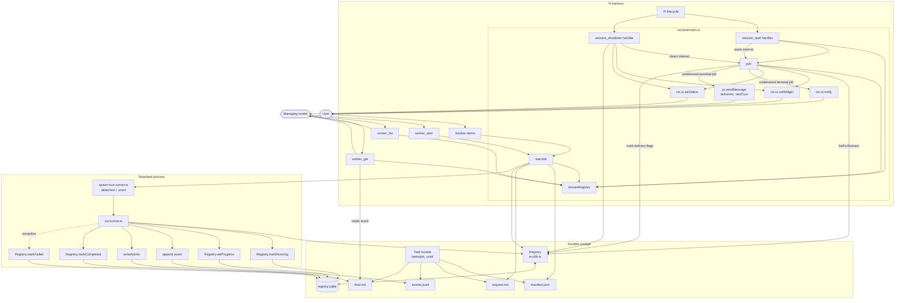
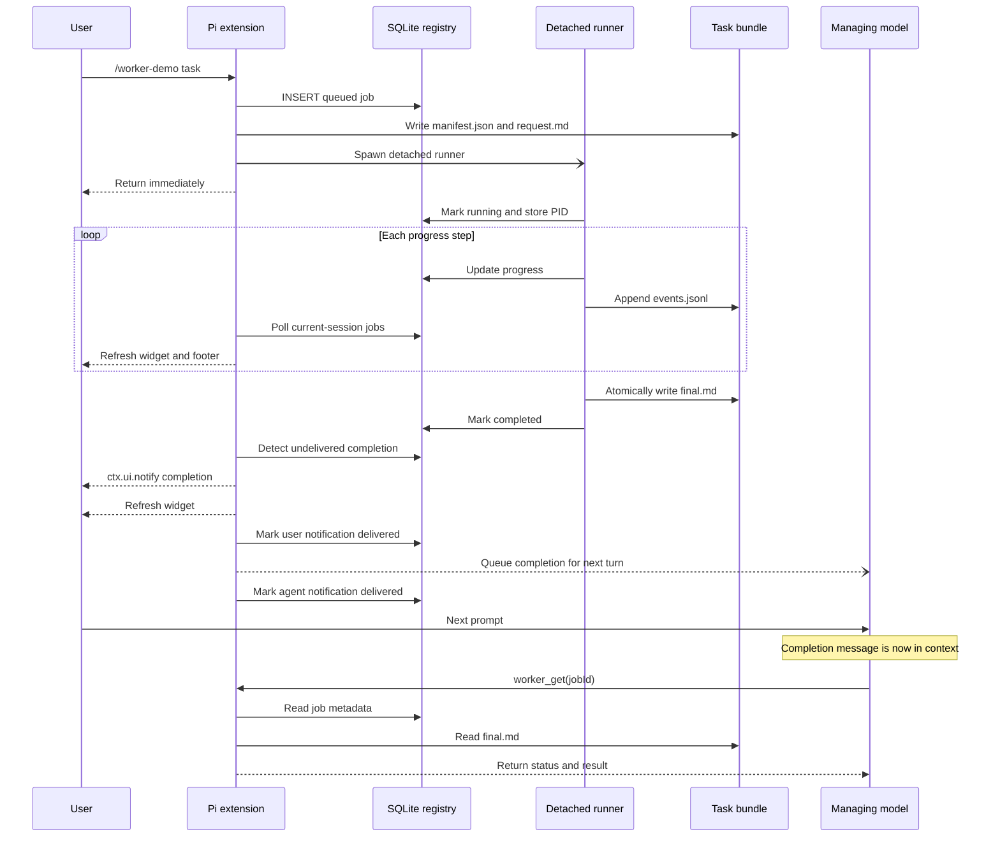

# Architecture

## Call graph

```mermaid
flowchart TD
    User([User])
    Model([Managing model])

    subgraph Pi[Pi harness]
        Lifecycle[Pi lifecycle]
        Command["/worker-demo"]
        ToolStart[worker_start]
        ToolList[worker_list]
        ToolGet[worker_get]

        subgraph Extension["src/extension.ts"]
            SessionStart[session_start handler]
            SessionShutdown[session_shutdown handler]
            StartJob[startJob]
            Poll[poll]
            EnsureRegistry[ensureRegistry]
            Widget[ctx.ui.setWidget]
            Status[ctx.ui.setStatus]
            Notify[ctx.ui.notify]
            AgentMessage["pi.sendMessage<br/>deliverAs: nextTurn"]
        end
    end

    subgraph Storage[Durable storage]
        RegistryClass["Registry<br/>src/db.ts"]
        SQLite[(registry.sqlite)]
        Bundle["Task bundle<br/>tasks/job_uuid/"]
        Manifest[manifest.json]
        Request[request.md]
        Events[events.jsonl]
        Final[final.md]
    end

    subgraph Detached[Detached process]
        Spawn["spawn bun runner.ts<br/>detached + unref"]
        Runner["src/runner.ts"]
        MarkRunning[Registry.markRunning]
        SetProgress[Registry.setProgress]
        WriteEvent[append event]
        WriteResult[writeAtomic]
        MarkCompleted[Registry.markCompleted]
        MarkFailed[Registry.markFailed]
    end

    User --> Command
    Model --> ToolStart
    Model --> ToolList
    Model --> ToolGet

    Command --> StartJob
    ToolStart --> StartJob
    ToolList --> EnsureRegistry
    ToolGet --> EnsureRegistry

    StartJob --> EnsureRegistry
    StartJob --> Manifest
    StartJob --> Request
    StartJob --> RegistryClass
    StartJob --> Spawn
    Spawn --> Runner

    Runner --> RegistryClass
    Runner --> MarkRunning
    Runner --> SetProgress
    Runner --> WriteEvent
    Runner --> WriteResult
    Runner --> MarkCompleted
    Runner -. exception .-> MarkFailed

    WriteEvent --> Events
    WriteResult --> Final
    MarkRunning --> SQLite
    SetProgress --> SQLite
    MarkCompleted --> SQLite
    MarkFailed --> SQLite
    RegistryClass <--> SQLite

    Lifecycle --> SessionStart
    Lifecycle --> SessionShutdown
    SessionStart --> EnsureRegistry
    SessionStart --> Poll
    SessionStart -->|starts interval| Poll
    SessionShutdown -->|clears interval| Poll
    SessionShutdown --> Widget
    SessionShutdown --> Status
    SessionShutdown --> RegistryClass

    Poll --> EnsureRegistry
    Poll -->|listForSession| RegistryClass
    Poll --> Widget
    Poll --> Status
    Poll -->|undelivered terminal job| Notify
    Poll -->|undelivered terminal job| AgentMessage
    Poll -->|mark delivery flags| RegistryClass

    Widget --> User
    Status --> User
    Notify --> User
    AgentMessage --> Model
    ToolGet -->|reads result| Final
    ToolGet --> Model
    ToolList --> Model

    Bundle --> Manifest
    Bundle --> Request
    Bundle --> Events
    Bundle --> Final
```

## Completion path

```mermaid
sequenceDiagram
    participant U as User
    participant P as Pi extension
    participant DB as SQLite registry
    participant R as Detached runner
    participant FS as Task bundle
    participant M as Managing model

    U->>P: /worker-demo task
    P->>DB: INSERT queued job
    P->>FS: Write manifest.json and request.md
    P-)R: Spawn detached runner
    P-->>U: Return immediately

    R->>DB: Mark running and store PID
    loop Each progress step
        R->>DB: Update progress
        R->>FS: Append events.jsonl
        P->>DB: Poll current-session jobs
        P-->>U: Refresh widget and footer
    end

    R->>FS: Atomically write final.md
    R->>DB: Mark completed
    P->>DB: Detect undelivered completion
    P-->>U: ctx.ui.notify completion
    P-->>U: Refresh widget
    P->>DB: Mark user notification delivered
    P--)M: Queue completion for next turn
    P->>DB: Mark agent notification delivered

    U->>M: Next prompt
    Note over M: Completion message is now in context
    M->>P: worker_get(jobId)
    P->>DB: Read job metadata
    P->>FS: Read final.md
    P-->>M: Return status and result
```
