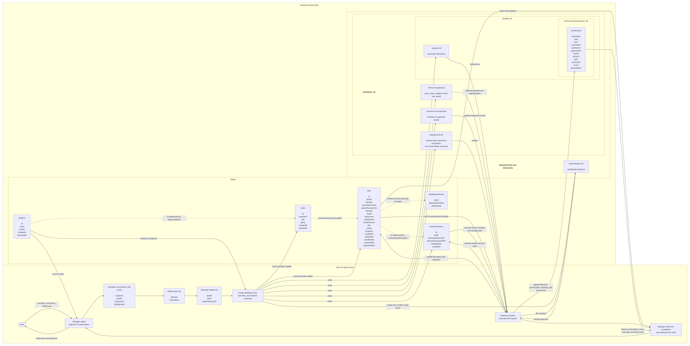

# Architecture



## Initial inputs

The user and manager agent discuss a piece of work. The manager translates the relevant parts of that conversation into:

- **`projectId`** — the registered project selected by the manager.
- Optional **`intent`** — why the user wants the work and the shape they want it to take, ideally preserved in their own words.
- Optional **`outcomes`** — a checklist of what should be observable when the task is complete.
- **`background`** — relevant facts, decisions, constraints, or a conversation summary needed to understand the task.

The manager harvests `intent` from the conversation rather than requiring the user to write a formal specification. It should preserve the user's wording even when that wording is informal or woolly. Technical specifications in the user's intent should remain intact because they may determine the shape of the result. If the user does not want to formalize intent, the manager writes a minimal faithful statement without adding ceremony.

When captured, `outcomes` should be an explicit checklist rather than something inferred from a short title. The manager may derive the checklist from the conversation, and the user may review or clarify it before jobs start.

When present, `intent` and `outcomes` are the primary basis for reviewing whether the completed task achieved what the user wanted. Either or both may be omitted when they would add no value. `background` provides context but is not itself an acceptance checklist.

The manager decomposes the task into jobs. Each job has:

- **`jobType`** — the purpose of the job.
- **`instructions`** — what that specific worker should do and return.

## Identity and creation order

The application generates stable IDs before creating database rows or filesystem records. SQLite and the filesystem do not assign these IDs.

- Generate `taskId`, then use it for both `tasks.id` and `tasks/<task-id>/`.
- Generate each `jobId`, then use it for `jobs.id`, `jobs/<job-id>/`, and the derived `worktrees/<job-id>/` path.
- Generate each `workerSessionId`, then use it for `workerSessions.id` and `worker-sessions/<session-id>/`.

For an existing codebase, the manager first selects an existing `projectId`; the application loads its `rootDir` and then creates the task. The `/worker-demo` fixture differs only in setup: it generates `taskId`, creates `.examples/worker-demo-<task-id>/`, registers that directory as a project, and then persists the task using the same `taskId`.

After project registration, generated demo projects and existing codebases follow the same task, job, worker-session, and worktree flow.

## Metadata (database)

SQLite stores structured metadata and query-friendly current-state projections.

### `projects`

- `id` — project identity used by tasks.
- `name` — user-facing project name.
- `rootDir` — main project checkout.
- `createdAt` — when the project was registered.
- `lastUsedAt` — when it was last selected for a task.

### `tasks`

- `id` — task identity.
- `projectId` — optional reference to `projects.id`.
- `title` — short, action-oriented summary derived by the manager from the available task files.
- `status` — overall task state.
- `createdAt` and `finishedAt` — task lifetime.
- One task can contain multiple jobs, such as implementation, review, and fixes.
- Example title: `Investigate flaky authentication tests`.

Task statuses:

- `queued` — created, but no job has started.
- `running` — at least one job has started and the task is not terminal.
- `completed` — all required jobs completed successfully.
- `failed` — a required job failed and the workflow cannot continue.
- `cancelled` — the task was explicitly cancelled.

Typical transitions are `queued → running → completed | failed | cancelled`. Task status is a database projection derived from its jobs plus explicit cancellation.

### `jobs`

- `id` — job identity.
- `taskId` — required reference to `tasks.id`.
- `jobType` — purpose such as `investigate`, `plan`, `implement`, `review`, `test`, or `fix`.
- `parentSessionId` and `parentSessionFile` — managing Pi session that owns notifications.
- `harness` — worker harness, such as Cursor, Codex, or Pi.
- `model` — exact model value used by the harness.
- `effortLevel` — requested reasoning or effort setting.
- `modelName` and `modelVersion` — normalized model identity for querying and comparison.
- `title` — short summary of this specific job.
- `status` and `progress` — current query-friendly projections.
- `createdAt` and `finishedAt` — overall job lifetime.
- `bundlePath` — job's file-storage directory.
- `userNotified` and `agentNotified` — completion-delivery state.
- Allowed `jobType` values are defined in TypeScript and stored as database text rather than as a database enum.

Job statuses:

- `blocked` — waiting for dependencies.
- `queued` — dependencies are satisfied and the job is waiting to start.
- `running` — the worker is executing.
- `completed` — the worker finished successfully; review findings do not by themselves make a review job fail.
- `failed` — the worker or harness failed.
- `cancelled` — explicitly cancelled before or during execution.
- `skipped` — not executed because a required dependency failed or was cancelled.

Typical transitions are `blocked → queued → running → completed | failed | cancelled`, with `blocked → skipped` for an unsatisfied failed dependency. Crashed workers are treated as `failed` in v0 rather than introducing a separate orphaned status.

### `workerSessions`

One job owns one resumable worker session.

- `id` — this system's worker-session ID.
- `jobId` — required reference to `jobs.id`.
- `harnessSessionId` — Cursor chat ID, Codex thread ID, or Pi session ID, when available.
- `harnessSessionPath` — harness-owned session file, when available.
- `storagePath` — this system's worker-session directory containing `events.jsonl`.
- `createdAt` — when the worker-session record was created.

### `jobDependencies`

- `jobId` — the dependent job.
- `dependsOnJobId` — an earlier job it needs.
- `relationship` — why it depends on that job, such as `reviews`, `modifies`, or `addresses`.

## Task data (file-based)

Task, job, and worker-session content is stored under the task directory. Worktrees are stored separately because they are temporary operational checkouts.

```text
worker-agent/
├── tasks/
│   └── <task-id>/
│       ├── intent.md        # optional
│       ├── outcomes.md      # optional
│       ├── background.md
│       └── jobs/
│           └── <job-id>/
│               ├── request.md
│               └── worker-sessions/
│                   └── <session-id>/
│                       └── events.jsonl
└── worktrees/
    └── <job-id>/
```

### `tasks/<task-id>/`

Files owned by the task and shared by all of its jobs:

- Optional `intent.md` — the user's intent, ideally in their own words, including any technical specifications that should shape the result.
- Optional `outcomes.md` — a reviewable checklist of what should be observable at the end of the task.
- `background.md` — relevant facts, decisions, constraints, and conversation context.

When present, use `intent.md` and the checklist in `outcomes.md` to review the completed task.

### `tasks/<task-id>/jobs/<job-id>/`

Files owned by one job:

- `request.md` — exact instructions for the worker.

### `tasks/<task-id>/jobs/<job-id>/worker-sessions/<session-id>/`

Files owned by one worker session:

- `events.jsonl` — canonical append-only worker-session record.

#### Common event fields

Every event has:

- `timestamp` — when it was recorded.
- `type` — what happened.

#### Session and process events

Types:

- `session.started`
- `session.completed`
- `error`
- `cancelled`

Fields when relevant:

- `pid`
- `exitCode`
- `error`

#### Prompt and assistant events

Types:

- `prompt`
- `assistant.started`
- `assistant.text`
- `assistant.thinking`
- `assistant.completed`

Fields when relevant:

- `text`

Thinking is recorded only when the harness exposes it.

#### Tool events

Types:

- `tool.started`
- `tool.output`
- `tool.completed`

Fields when relevant:

- `toolCallId`
- `toolName`
- `arguments`
- `result`
- `isError`
- `artifactPath` — references output that is too large to store inline.

`toolCallId` is the only correlation ID in the event format. The harness normally provides it; an adapter assigns one when it does not.

#### Event-log rules

- `events.jsonl` is append-only and records everything observable as it happens.
- Its path identifies the worker session, job, and task, so those IDs are not repeated in each event.
- File order provides message and turn order; `turnId`, `messageId`, and sequence fields are unnecessary.
- Large outputs are stored separately and referenced with `artifactPath`.

#### Derived views

- The conversation transcript is derived by replaying message, thinking, and tool events.
- Turns are derived from ordered assistant and tool events; they do not need IDs or tables.
- Tool calls are grouped by `toolCallId`; they do not need a table.
- The final response is the last completed assistant message when the job settles successfully.
- A generated `final.md` may be provided as a disposable export, but `events.jsonl` remains authoritative.
- Database job status and progress are projections used by the manager and widget; the event log preserves their history.

### Worktree

For a project job, the extension:

- Creates the job and assigns its `id`.
- Loads the project through `tasks.projectId`.
- Reads the project's `rootDir`.
- Computes the worktree path as `worktrees/<job-id>/`.
- Creates the git worktree.
- Executes the worker inside it.

The worktree path is derived from the job `id`; it is not stored on the job. Jobs whose task has no project do not receive a project worktree.

## Source layout

```text
src/
├── extension.ts       # minimal Pi extension entry point
├── extension/         # Pi tools, commands, lifecycle, widgets, notifications
├── workflows/         # task/job orchestration and dependency scheduling
├── demo/              # hardcoded `/worker-demo` project fixtures
├── domain/            # data types, IDs, statuses, and dependency rules; no I/O
├── storage/           # SQLite registry, task files, event log, and paths
├── harnesses/         # normalized adapters for Pi and later harnesses
└── runner/            # detached process entry point and launcher
```

Tests live in the repository-level `__tests__/` directory. Keep pure formatting and conversion logic as functions; use classes for stateful services and lifecycle ownership.
