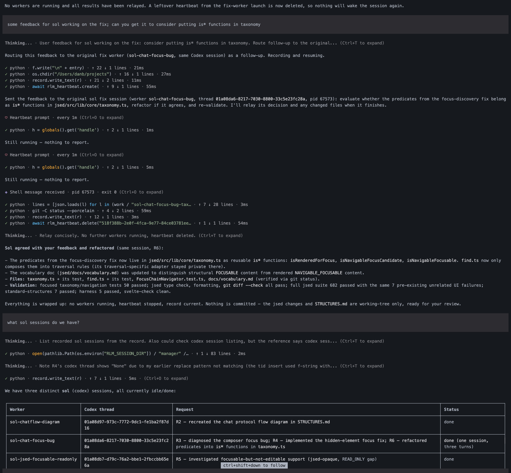

# prime-worker

You run [prime-agent](https://github.com/PrimeIntellect-ai/prime-agent) and chat
to an agent acting as your managing agent. The manager delegates/routes work
(eg coding, investigation, review) to other agents. Those agents could be
running in cursor, codex, claude-code or natively (using prime-agent via
[RLM](https://www.primeintellect.ai/blog/rlm)]).

You talk to the manager in your own words:

```text
get grok to implement demo 2 in notes.md
get sol to review grok's work
get grok to process sol's review
```

It resolves the name to a model, effort level and harness, launches a worker,
tracks it, and relays the result. It does not investigate, plan, or rewrite what
you asked for unless you want it to.  The manager tracks worker sessions so you
can feed work to an existing worker eg to give feedback.

Inspired by Kun Chen's [firstmate](https://github.com/kunchenguid/firstmate).

## Example session



What is happening there:

- Feedback for an agent already working is routed to **that** worker, in its existing
  Codex session — `sol-chat-focus-bug`, thread `01a08da6…` — rather than starting a new
  one. Three turns of work, one session.
- The launch does not block. The manager reports what it sent and ends the turn.
- A one-minute heartbeat checks the external worker (external harness) until it exits, then reads its
  output, relays the result, updates the record, and deletes itself.
- Asking "what sol sessions do we have?" is answered from the request record: each
  worker handle, its harness session ID, what it was asked, and its status.

### The author's note

My thoughts and assumptions as at Aug-2026:

- I'm running on a budget so I'm generally not using intelligence signifcantly above sol 5.6 medium level
- I'm juggling between very modest codex, curosr, claude subscriptions and trying to take advantage of cheap but powerful open weight models via openrouter or similar
- I'm working on slightly novel non-trivial projects, and I'm just not comfortable blackboxing them, I need to understand the code at least as a well-structured system and my obervation is that agents can write great code but architecture is not quite there (this is changing all the time)
- I have various directives for the coding agent to encourage it to structure code so it's not just a bag of functions and to encourage it to focus on entities and data modelling and testable code (eg dependency injection, nulled instances). This is not included here, it's something you put in or link to from your AGENTS.md for the project the coding agent is working on
- My preferred approach is:
  - avoid ai generated plans; faithfully relay or expand the user's words
  - the user's words are much easier for the user to understand
  - the user is not good at reviewing long documents that have hidden catches or assumptions
  - user should try to work in small iterations with immediate demonstrable feedback to keep any planning small
    - also avoids risk of generating lots of code unanchored to some tangible outcome, which is very easy to do with agents.
    - (In other words, agile still wins and waterfall can be weirdly magnified via AI slop)
  - ambiguities and misunderstandings get hammered out in review or via investigative tasks issues before building anything
- Earlier attempts at a managing agent in pi or prime-agent harness didn't work for me
  - they had project management structures and workflows which I could not decide on
  - it led to a weird combination of scripting and deterministic code mixed with agent discretion
  - you can end up writing lots of "management code" this way, which I ended up throwing away
  - everything took time with workflows: a model might write up a feature or issue, another model would draft a plan, then that plan would be sent to another model to implement, then finally the work would be given to another model to review...
  - "game of telephone" effect: things would get put into the plan that I didn't expect and then were faithfully executed by the coding agent,
  - excessive review not commensurate with the type/scope/intention of the task
  - all of which leads to "paperwork fatigue": too much ai generated verbiage: I'd spend time reading long ai-generated descriptions and plans and reviews
- I've played with using various models to act as the managing agent
  - atm GLM 5.3 flash via openrouter is cheap as chips and quite solid if you can find a fast provider. deepseek v4 flash
    on high also cheap sometimes frustrating; both have large context. You can also use openai models (at
    the time, you can use openai subscription with pi / prime-agent harness).

## Setup

You need Prime Agent installed and authenticated, plus the CLI of any external harness
you use (`codex login`, `cursor-agent login`, `claude`). `tmux` is optional — it is only
needed to [talk to a worker directly](#talking-to-a-worker-yourself).

Put the CLI on your PATH:

```bash
ln -s /path/to/prime-worker/bin/prime-worker ~/.local/bin/prime-worker
```

There is a [Taskfile.yml](./Taskfile.yml).

## Use

### Two modes

**`PROJECT_MODE`**: launch prime-worker inside a project

```bash
cd /path/to/your-project
prime-worker
```

That opens the normal interactive Prime Agent UI with the manager active, in your
project, so its `AGENTS.md` and skills load as usual. Then just talk to it.

**`HUB_MODE`** lets one session drive several projects. Put a `workspaces.toml` in a
folder and launch from there:

```toml
[workspaces]
api = "/path/to/api"
web = "/path/to/web"
```

```bash
cd ~/work        # the folder holding workspaces.toml
prime-worker
```

Now you name the project: "get grok to implement demo 2 in api". Worktrees are not
configured here — they are discovered with `git worktree list` when needed.

The mode is decided by whether `workspaces.toml` is in the directory you launch from.
See [workspaces.example.toml](workspaces.example.toml).

In general:

Prime Agent flags pass through (`prime-worker --resume`, `--model ...`). The script's
own flag is `--models <path>` to use a different alias file. Without it, a `models.toml`
in the directory you launch from is used, else this repo's.

Do not use `-p` / `--print` / `--mode json`: those are one-shot sessions that get torn
down at the end of the turn, cancelling any worker mid-task.

## Configuring agents

[models.toml](models.toml) is the only file you edit. It is keyed by harness, then
agent:

```toml
[defaults]
grok = "cursor"        # the harness grok uses unless you say otherwise

[cursor.grok]
default   = "high"     # the effort used unless you name another
high      = "cursor-grok-4.6-high"
high-fast = "cursor-grok-4.6-high-fast"   # used when you say "fast"

[codex.sol]
default = "medium"
medium  = "gpt-5.6-sol"
high    = "gpt-5.6-sol"
```

Say a harness or an effort to override the default for one request — "get sol high to
review this", "get grok to implement demo 2 with codex". Anything not listed is not
configured: the manager says so rather than assembling a model name.

Work is passed out to external harnesses:

| Say     | Harness     | Model                                                  |
| ------- | ----------- | ------------------------------------------------------ |
| `grok`  | Cursor      | `cursor-grok-4.6-high` (`grok fast` for the fast tier) |
| `sol`   | Codex       | `gpt-5.6-sol` at medium                                |
| `astra` | Codex       | `gpt-6-astra` at low                                   |
| `opus`  | Claude Code | `claude-opus-5` at high                                |
| `fable` | Claude Code | `claude-fable-5-1` at high                             |

Plus native workers for `kimi`, `deeppro`, `deepflash`, and `glm`, which run as Prime
Agent children rather than a separate CLI.

## How it works

The manager keeps one Markdown file in its own session directory
(`~/.prime/agent/session-artifacts/<session-id>/manager/requests.md`) holding your
wording, the worker's identity, status, and result. Nothing is written into your
repository.

Native workers are Prime Agent RLM children, addressable for follow-ups while the
manager session is open — so "get grok to process sol's review" reaches the original
worker in its original session. External workers are CLI invocations; the manager
captures the harness's own session ID and resumes through that CLI.

Nothing blocks. A launch ends the turn, and you keep talking. Native results arrive by
agent message; external workers are checked by a single one-minute heartbeat that stays
silent until something finishes.

Several workers can run in the same checkout, with no locking. Ask for a worktree if you
want isolation — in HUB_MODE they are created with plain `git worktree` under
`<hub>/worktrees/<workspace>/<worker-handle>`, on a branch of the same name. The manager
records which worker owns which worktree, and never removes one; on restore it points
out any whose worker is gone.

## Talking to a worker yourself

Sometimes relaying through the manager is the wrong shape — you want to argue with the
worker directly. Ask for it:

```text
let me talk to grok about demo 2
```

The manager resolves the handle to that worker's recorded session, opens it in a tmux
window with the harness's *interactive* resume (`codex resume`, `cursor-agent --resume`,
`claude --resume`, or `prime-agent attach` for a native worker), and hands you one line:

```bash
tmux attach -t prime-worker
```

One tmux session named `prime-worker`, one window per worker handle. Your manager
terminal is covered while you are attached; `prefix+d` detaches and you are back with
the manager still running. The manager cannot attach for you — it has no terminal of its
own — so that command is yours to run.

It is the same session, not a copy. Whatever you say there is in the worker's context
when the manager next resumes it. What the *manager* loses is sight of those turns, so
it marks the request `user-driving`, stops resuming that session — no follow-ups, no
review routing, and the heartbeat leaves it alone — and asks the worker what you settled
rather than inventing a result it never saw.

Two things worth knowing:

- The worker has to be idle first. Two processes writing one session diverge, so the
  manager refuses the handoff while the worker is mid-run and offers to send a message
  instead.
- An interactive resume uses *your* harness config, not the flags the manager launched
  with. A worker started read-only may come back with your own sandbox settings.

## Resume

Closing the terminal detaches the client; the worker and its children keep running.

```bash
prime-agent list
prime-agent attach <agent>
```

If the worker has stopped, `prime-worker --resume` from the same project. Resume the
**original** manager session — a new one does not inherit its children. On restore the
manager reconciles its record against the live registry before claiming anything is
still running.

## Verified

Last checked 2026-09-10. Harness CLIs ship often, so treat these as "true when
tested" rather than permanent, and re-verify anything that matters:

- Skills load, the manager activates, and the project's own `AGENTS.md` still applies.
- The full chain against a real checkout: implement, review by a second worker, then
  routing the review back to the _same_ worker rather than a replacement.
- The request record is written, reconciled against the live registry after reattach,
  and a failed worker is reported as failed rather than quietly relaunched.
- Codex, Cursor, and Claude Code each launch, return a real session ID, and resume it
  with context intact.
- Cursor takes its prompt positionally and has no stdin form; a stdin prompt is silently
  never delivered and the run still reports success.

Not yet exercised in a live session: the `models.toml` read, the one-minute heartbeat
for external workers, the interactive resident-worker path (demos ran over RPC), and the
tmux handoff — the interactive resume commands are `--help`-verified against the CLIs
installed here (`codex-cli 0.153.4`, `cursor-agent 2026.09.10`, `claude 2.1.268`), but
no worker has actually been handed over mid-session yet.

Known limitations:

- Claude Code does not read `AGENTS.md`; its reference adds a prompt preamble.
- `codex exec resume` takes neither `-C` nor `-s`: set the subprocess working directory
  and use `-c sandbox_mode=`.
- Cursor needs `--trust` for an unseen directory, and bakes the reasoning level and fast
  tier into the model name.

## License

MIT — see [LICENSE](LICENSE).
