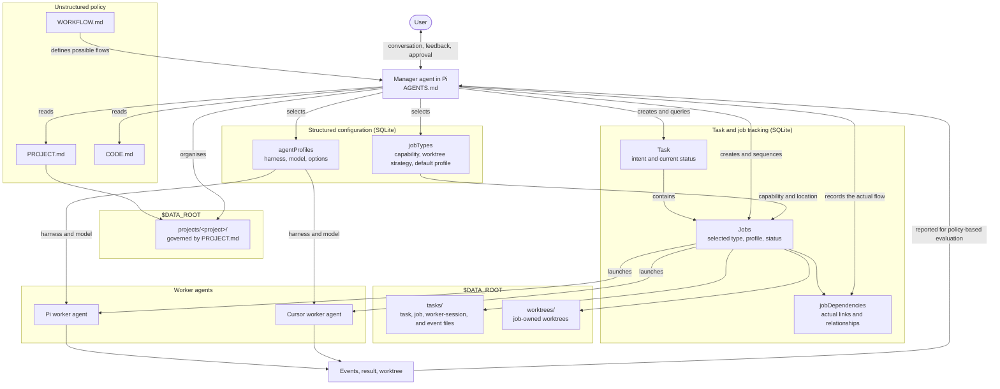

# pi-worker-agent

A local [Pi](https://github.com/badlogic/pi-mono) extension that lets one manager agent organise and supervise coding agents.

This is experimental and has barely been tested beyond the author's hot little hands. Expect rough edges.

## Why?

The user talks to one manager agent in Pi. That manager can organise workers across different models and harnesses—for example, Sol 5.6 workers through the Pi harness and Grok workers through the Cursor harness.

Every piece of work is represented as a durable **task** containing one or more **jobs**. You can design any workflow you want by defining its job types, dependencies, order, evaluation, and approval points in `WORKFLOW.md`. For example, the author's default coding workflow is:

```text
plan → implement → review
```

That sequence is an example policy, not a workflow built into the application.

The runner does not hardcode what higher-level work means. Project management—the stories, epics, priorities, review rules, and acceptance process—is deliberately controlled by editable policy documents. The author's policy favours small **Vertical slices**, real user-observed Demos, and a tight OODA loop so agent work stays grounded in outcomes.

See [`examples/`](examples/) for the policy documents used by the author.

## How it works



There are three deliberately separate parts:

- **Policy documents** provide flexible, human-readable meaning: how projects are organised, which job types form a workflow, how results are evaluated, and when the user should be asked to inspect, Demo, or merge work.
- **Database configuration** provides precise, structured choices the user can customise: agent profiles, models, harness options, job types, their selected trusted capabilities, worktree strategies, and defaults.
- **Task and job execution** provides the general machinery and durable state: persist tasks and jobs, enforce dependencies, launch workers, record events, manage worktrees, and safely inspect or merge results. It follows database configuration rather than assigning special meaning to names such as `implement` or `review`.

`WORKFLOW.md` describes the flows the manager may choose. Each `jobDependencies` row records the concrete link and relationship between jobs in the flow that actually occurred.

The user works with the manager, not the workers directly. The manager interprets the policy, selects database configuration, gives each worker a bounded job, evaluates the returned result, and brings decisions or observable outcomes back to the user.

## Try it locally

> ⚠️ **Not quite ready:** the clean-install and conversational setup path described below has not yet been tested end to end. Expect gaps on a fresh clone.

You need Pi and Bun installed. Clone the repository, install dependencies, and launch Pi from inside it:

```bash
git clone https://github.com/danielbush/pi-worker-agent.git
cd pi-worker-agent
bun install
pi
```

Pi loads the local extension from:

```text
.pi/extensions/worker-agent/index.ts
```

Once Pi opens, ask the manager agent:

> What should I do next?

The intended flow is for the manager to explain the system, check its setup, and walk you through policy and execution configuration.

The manager starts with restricted tools. Use `/development-mode` only when you intentionally want to let it modify this codebase directly; `/manager-mode` returns to restricted manager tools.

## Data and policy

Worker-agent state defaults to the repository's gitignored `work/` directory. That is convenient for trying it, but for ongoing use you may want the data outside the clone so it can be organised, backed up, and retained independently:

```dotenv
DATA_ROOT=/path/to/worker-agent-data
```

A worker-agent-specific override takes precedence:

```dotenv
PI_WORKER_AGENT_DATA_ROOT=/path/to/worker-agent-data
```

The data root holds the SQLite registry, durable task/job files, project-management files, and policy documents:

- `PROJECT.md` — how higher-level projects and work are organised.
- `WORKFLOW.md` — how jobs are sequenced, reviewed, revised, and accepted.
- `CODE.md` — coding, architecture, testing, and safety conventions.

Ask the manager to help create or adapt these files from the examples rather than treating the author's preferences as hardcoded product behavior.

## Safety warning

Sandboxing remains an ongoing issue.

- The Pi manager starts in application-restricted manager mode.
- Pi workers run through OS sandboxing provided by `@anthropic-ai/sandbox-runtime`.
- Cursor workers currently cannot use the same sandbox reliably because the Cursor SDK stream stalls behind its HTTP proxy. They therefore run with an explicit `NullSandbox` as trusted same-user processes.

A Cursor worker still gets an isolated Git worktree and minimal environment, but its shell is **not** confined by an OS sandbox. Be careful about which repositories, credentials, prompts, and job capabilities you give it. See [`ISSUES.md`](ISSUES.md) for the current limitation.

## Development checks

```bash
bun run test
bun run typecheck
```

For implementation details, see:

- [`ARCHITECTURE.md`](ARCHITECTURE.md)
- [`DESIGN.md`](DESIGN.md)
- [`ISSUES.md`](ISSUES.md)

## Inspiration

Inspired by Kun Chen's [firstmate](https://github.com/kunchenguid/firstmate)—check it out, along with [Kun Chen's posts and videos](https://x.com/kunchenguid). This project is an attempt to roll a smaller, policy-driven version using Pi and Bun.
