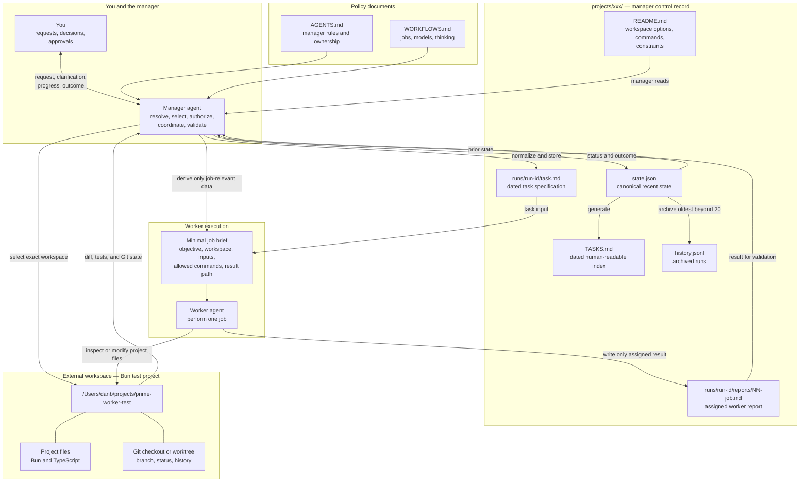

# Architecture

Prime Worker Agent separates manager-owned control records from external project
workspaces. The manager turns a user request into a dated task, selects a
workflow and workspace, gives each worker a minimal brief, evaluates job
results, and updates the durable project record.

## Data flow

## Inputs

- The user's request and later clarifications.
- `WORKFLOWS.md`, which selects jobs, models, and thinking levels.
- `projects/<name>/README.md`, which gives the manager workspace options,
  approved commands, constraints, and stable project facts.
- Recent state, archived history, earlier job results, and the live workspace.

## Processing and transformation

1. The manager resolves the project and workflow.
2. It selects and verifies an exact external workspace, including a worktree
   when appropriate.
3. It normalizes the request into a dated `runs/<run-id>/task.md` with explicit
   acceptance criteria.
4. For each job, it derives a minimal worker brief. The brief names the exact
   workspace, relevant inputs and constraints, allowed commands, and one result
   file.
5. The worker changes only the external workspace and writes only its assigned
   result file in the control record.
6. The manager validates the workspace and written result, then continues,
   retries, fails, or completes the run.

## Storage

- `state.json` is the canonical state for the latest 20 runs.
- `TASKS.md` is a dated, generated view of `state.json` for people. It can be
  rebuilt and is never the source of truth.
- `runs/<run-id>/task.md` is the manager-owned detailed task specification.
- `runs/<run-id>/reports/<NN>-<job>.md` is the assigned worker's report.
  Two-digit sequence numbers record actual execution order; retries append a
  new report instead of overwriting an earlier attempt.
- `history.jsonl` is the append-only archive for older runs.
- The external workspace stores project changes and Git history. It normally
  lives outside `projects/<name>/`.

## Outputs

- Project changes in the selected external workspace.
- Worker reports under the run directory.
- Updated canonical state, generated task index, and archived history.
- Plain-language progress and final results sent to the user.

## Ownership

| Data | Writer |
|---|---|
| Project README, `state.json`, `TASKS.md`, `history.jsonl`, `task.md` | Manager only |
| Run directory and run metadata | Manager only |
| `runs/<run-id>/reports/<NN>-<job>.md` | Only the worker assigned that file |
| External workspace | Workers, within the scope and commands authorized by the manager |
