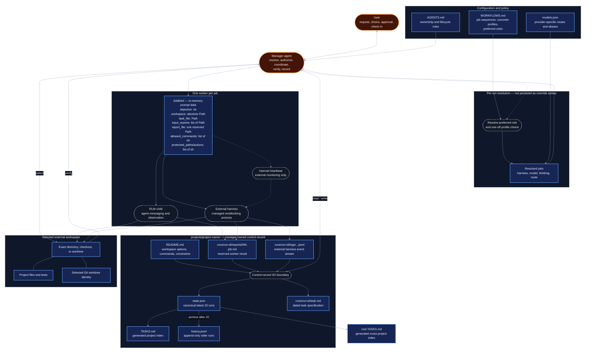

# Architecture

A user gives the manager a request. The manager combines policy, workflow
defaults, model routing, and any one-off choice to resolve the jobs; records the
task and state in the project control record; sends each worker a focused
`JobBrief`; and verifies its report and workspace changes before updating the
project and root task indexes.

## System boundaries



The diagram uses visual weight to emphasize data:

- **Dark blue, square, solid boxes** are data or durable artifacts.
- **Charcoal, rounded, dashed boxes** are processes or runtime components.
- **Dark orange pills** are actors.

All diagram text, group titles, edges, and labels use a forced dark palette with
light foreground colors, independent of the page theme.

Arrow labels are limited to boundary operations where direction alone is not
enough. Group outlines show ownership or placement, not additional processes.

## Request and job resolution

A workflow defines job order using preferred roles. The Preferred profiles table
maps each role to a concrete `role/model[/route]` profile, which bundles a
harness, model selector, thinking level, and optional provider route. A one-off
concrete-profile choice changes one job for one run; it does not create another
workflow.

Override-like YAML shown in `WORKFLOWS.md` is request notation only. The manager
must never copy a `job_overrides` object or profile selector into `state.json`.
Before creating a run, it resolves every job and stores only actual execution
values:

```json
{
  "job": "implement",
  "harness": "rlm",
  "model": "openrouter-morph/moonshotai/kimi-k3",
  "thinking": "medium",
  "route": "morph/fp4",
  "status": "pending",
  "report_file": "runs/2026-09-06-0140-build-no-plan/reports/01-implement.md"
}
```

These resolved values are historical facts. Later edits to a concrete profile or
preferred-role mapping do not change an existing run. A retry inherits the prior execution choice unless the
user explicitly requests another one. Each attempt records what it actually
used.

Provider routing is part of model configuration, not an `rlm()` argument.
OpenRouter routes use model overrides or routed provider aliases in
`~/.prime/agent/models.json`. A configuration change requires `/reload` before
the selector is used.

## Run lifecycle

1. Resolve the project, workflow, and actual execution fields for every job.
2. Select and verify the exact workspace. When Git is present, verify both the
   worktree root and common Git directory; never silently substitute another
   checkout.
3. Create `runs/<run-id>/reports/` and manager-owned `task.md` before launching
   a worker.
4. Add the run and resolved jobs to `state.json`, then regenerate project and
   root indexes.
5. Launch one worker per job, in workflow order unless jobs are independent.
6. Read the assigned report and inspect the workspace. A successful process
   exit alone is not completion.
7. Run only authorized verification commands. Update state and indexes at each
   status change.
8. If review fails, return to the implementation job with the review report as
   input. After two failed review attempts, block the run and check in with the
   user before starting more implementation or review work.
9. On success or terminal failure, record timestamps and a concise outcome.

## Worker isolation

Every worker receives a minimal brief rather than the complete project control
record. `JobBrief` is a conceptual in-memory structure that the manager renders
into the worker prompt; it is not another file or a structure copied into
`state.json`:

```text
JobBrief
  objective: str                 # job goal and acceptance criteria
  workspace: absolute Path       # only project execution root
  task_file: Path                # manager-owned task specification
  input_reports: list[Path]      # authoritative outputs from earlier jobs
  report_file: Path              # sole control-record write target
  allowed_commands: list[str]    # authorized mutating/project commands
  protected_paths: list[Path]    # files and trees that must not change
  prohibited_actions: list[str]  # branch, credential, network, or other limits
```

The referenced files remain the durable data. The prompt contains their paths,
not copied file objects. The fields mean:

- **Objective:** one job objective plus its acceptance criteria and relevant
  constraints;
- **Workspace:** the exact absolute execution path and an instruction to change
  into it first;
- **Inputs:** the manager-owned `task.md` path and paths to required earlier job
  reports, never in-memory objects or unrelated run context;
- **Output:** exactly one reserved `reports/<NN>-<job>.md` path;
- **Authorization:** the exact install, dependency, generation, build, test,
  typecheck, migration, deployment, service, and Git-mutating commands allowed
  for that job; read-only discovery is allowed unless project policy says
  otherwise; and
- **Protection:** paths, branches, competing implementations, credentials, and
  external actions the worker must not access or modify.

Workers modify only the selected workspace. Their sole write permission in the
control record is their assigned report. Workers must not edit `README.md`,
`state.json`, `TASKS.md`, `history.jsonl`, `task.md`, another report, or run
metadata.

Independent comparison workers must not inspect competing branches or their
reports.

## RLM and external harnesses

### RLM workers

An RLM spawn returns a child handle immediately. Completion arrives through
agent messaging; bounded observation can inspect progress. Short RLM jobs do
not need a heartbeat. Add one only for work expected to be long, silent, or in
need of stall detection.

### External workers

A process such as `cursor-agent` is not an RLM child. It has no agent messaging,
family roster, or observation channel. When such a harness is selected, the
manager conditionally loads `.agents/skills/run-external-worker/SKILL.md` and:

- starts it nonblockingly and retains its process handle;
- writes its `stream-json` output to a durable run log;
- records the harness, exact model, log path, process metadata, and session ID;
- creates a two-minute internal follow-up heartbeat immediately;
- polls without blocking and reads only the durable log tail;
- reports only meaningful progress, blockers, or completion; and
- deletes the heartbeat after terminal verification.

The heartbeat is an ephemeral scheduler. `state.json`, the harness log, captured
session ID, assigned report, and workspace are the recovery record. Raw logs
are audit material and are not normal input to later jobs; later jobs read the
written report.

## Storage and consistency

| Data | Purpose | Writer |
|---|---|---|
| `projects/<name>/README.md` | Stable workspace choices, commands, and constraints | Manager |
| `state.json` | Canonical machine-readable latest 20 runs | Manager |
| project `TASKS.md` | Generated view of one project state | Manager |
| root `TASKS.md` | Generated cross-project view | Manager |
| `history.jsonl` | Append-only complete runs older than the latest 20 | Manager |
| `runs/<run-id>/task.md` | Dated request and acceptance specification | Manager |
| `runs/<run-id>/reports/<NN>-<job>.md` | Authoritative result for one execution | Assigned worker |
| `runs/<run-id>/logs/*.jsonl` | Durable external harness event stream | External harness via manager launcher |
| external workspace | Project implementation and tests | Authorized worker |

Report numbers are global within a run and reflect actual execution order across
job names and retries. A report path is reserved atomically and is never reused
or overwritten by another attempt.

State replacement and generated indexes use atomic writes. Same-project state
and project-index work is serialized with a project lock. Cross-project root
index generation uses a separate root lock with a consistent lock order.
History append and state replacement form a multi-file transaction boundary;
recovery must reconcile an interrupted archive operation before any later
mutation and must keep history content consistent with the `archived` counter.

`state.json` is the only source of truth for current runs. `TASKS.md` files are
rebuildable views. Do not read all of an unbounded state or history file into
model context; load state into code and display only relevant slices, and read
only history tails or targeted matches.

## Status and completion

Run statuses are `queued`, `running`, `blocked`, `done`, `failed`, and
`cancelled`. Job statuses are `pending`, `running`, `done`, `failed`, and
`skipped`; legacy stored `queued` reads as `pending`.

Transitions must preserve run/job consistency and refresh retry timestamps. A
run cannot be complete while a required job is active or failed. Completion
requires all of the following:

- a usable assigned report;
- manager inspection of the workspace;
- authorized verification results;
- consistent durable state and generated indexes; and
- a user-facing outcome.
